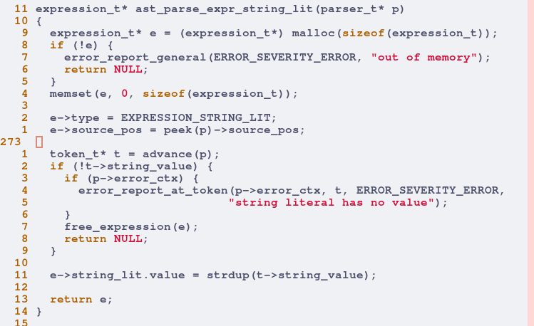
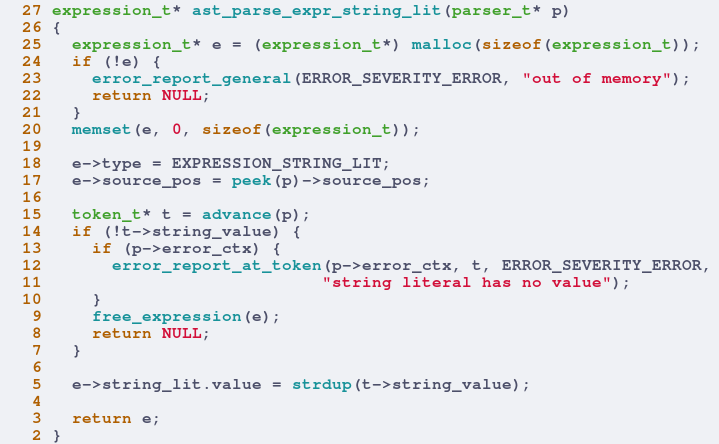

# Vim better C syntax highlightning

This simple vim script aim to enhance a bit c syntax highlightning inside vim \

### Installation

To use this, you have to add `c.vim` file inside your `$HOME/.vim/after/syntax/` directory

### How to use

This script basically apply after all the others c related syntax file and add the necessary coloring to it. \
The best way to use it is without any other vim script related to c syntax. \
This script and the default vim one should be enough to color c file.

### Example

#### Without c.vim 

#### With c.vim 

